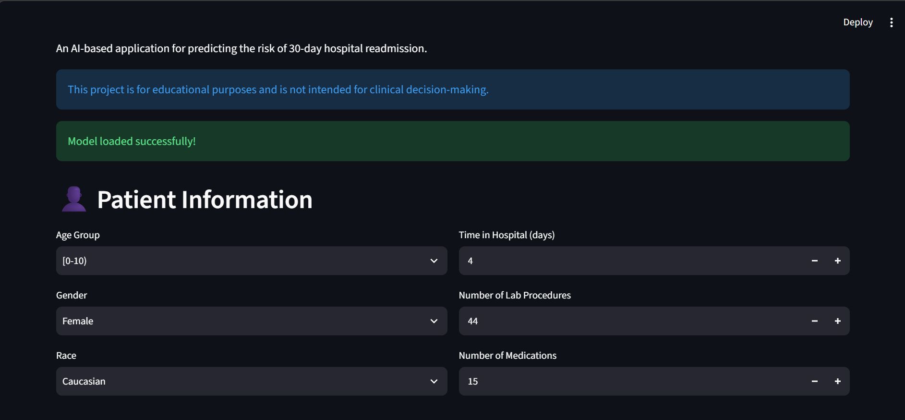
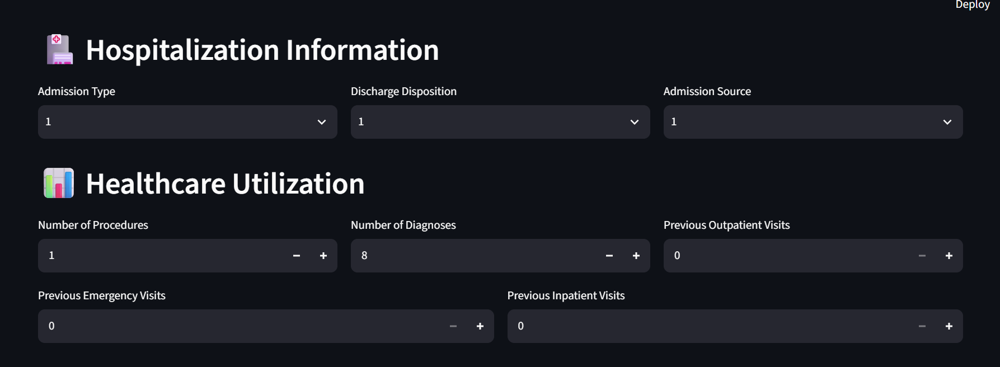
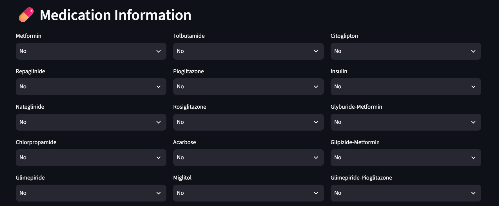
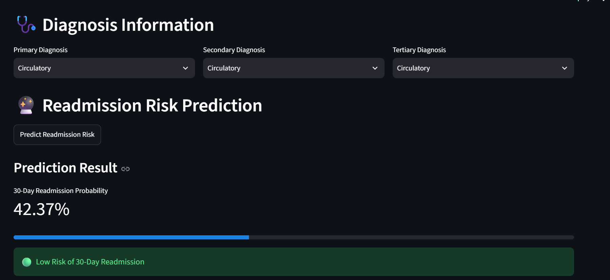

# 🏥 Hospital Readmission Risk Prediction & Analytics

An end-to-end machine learning project for estimating the probability of 30-day hospital readmission using the Diabetes 130-US Hospitals dataset.

The project covers data cleaning, exploratory data analysis, feature engineering, patient-aware train/test splitting, SQL analytics, machine learning model development, hyperparameter tuning, model evaluation, feature importance analysis, and a Streamlit application.

> ⚠️ **Disclaimer:** This project is developed for educational and portfolio purposes only. It is not intended for clinical diagnosis, medical advice, or real-world medical decision-making.

---

## 🎯 Problem Statement

Hospital readmission is an important healthcare challenge. The objective of this project is to build a binary classification model that estimates whether a diabetic patient is likely to be readmitted to the hospital within 30 days of discharge.

### Prediction Question

**Can we identify patients with a higher estimated probability of 30-day readmission using information available from their hospital encounter?**

---

## 📊 Dataset

The project uses the **Diabetes 130-US Hospitals for Years 1999–2008** dataset.

### Dataset Overview

- **101,766** hospital encounters
- **71,518** unique patients
- **50** original features
- Data collected from **130 US hospitals**
- Healthcare records covering diabetes-related hospital encounters

The dataset contains information related to:

- Patient demographics
- Hospital admission and discharge
- Laboratory procedures
- Medications
- Diagnoses
- Healthcare utilization
- Diabetes treatment
- Readmission status

### Target Variable

The original `readmitted` variable contains three categories:

- `<30` → Readmitted within 30 days
- `>30` → Readmitted after 30 days
- `NO` → Not readmitted

For binary classification, the target was transformed into:

| Value | Meaning |
|---|---|
| `1` | Readmitted within 30 days |
| `0` | Not readmitted within 30 days |

### Target Distribution

| Class | Encounters | Percentage |
|---|---:|---:|
| Not readmitted within 30 days | 90,409 | 88.84% |
| Readmitted within 30 days | 11,357 | 11.16% |

Because the target is imbalanced, the project focuses on **Precision, Recall, F1-Score, and ROC-AUC** rather than relying only on accuracy.

---

## 🛠️ Technologies Used

- **Python**
- **Pandas**
- **NumPy**
- **Matplotlib**
- **Seaborn**
- **Scikit-learn**
- **SQL / SQLite**
- **Streamlit**
- **Jupyter Notebook**
- **Joblib**
- **Git & GitHub**

---

## 🔄 Project Workflow

```text
Dataset
   ↓
Data Understanding
   ↓
Data Cleaning
   ↓
Exploratory Data Analysis
   ↓
Feature Engineering
   ↓
SQL Analysis
   ↓
Patient-Aware Train/Test Split
   ↓
Data Preprocessing
   ↓
Machine Learning
   ↓
Model Evaluation
   ↓
Hyperparameter Tuning
   ↓
Feature Importance Analysis
   ↓
Threshold Analysis
   ↓
Streamlit Application
```

---

## 🧹 Data Cleaning & Preprocessing

The dataset required several data quality and preprocessing steps before model development.

### Cleaning steps

- Checked for duplicate records
- Checked unique encounters and patients
- Removed columns with extensive missing information:
  - `weight`
  - `medical_specialty`
  - `payer_code`
- Replaced `?` values with `Unknown`
- Replaced missing values in:
  - `A1Cresult`
  - `max_glu_serum`

  with `Not measured`
- Converted categorical ID columns to string type
- Grouped rare categorical values into `Other`
- Removed `encounter_id` and `patient_nbr` from model features
- Grouped diagnosis codes into broader diagnosis categories
- Removed the original diagnosis code columns after grouping

### Final cleaned dataset

- **101,766 rows**
- **46 model-ready columns before preprocessing**
- No remaining `?` values
- No remaining missing values

---

## 🔎 Exploratory Data Analysis

EDA was performed to understand patient demographics, hospitalization patterns, healthcare utilization, and their relationship with 30-day readmission.

### Key observations

- The largest age group was **70–80 years**, with 26,068 encounters.
- Female patients accounted for **54,708** encounters and male patients for **47,055**.
- Patients with more previous inpatient visits generally showed higher 30-day readmission rates.
- Previous inpatient utilization showed a strong relationship with readmission behavior.
- Readmission patterns varied across diagnosis groups, length of stay, medications, and healthcare utilization variables.

---

## ⚙️ Feature Engineering

Several transformations were applied to make the healthcare data suitable for machine learning.

### Diagnosis grouping

Individual ICD diagnosis codes were grouped into broader clinical categories such as:

- Diabetes
- Circulatory
- Respiratory
- Musculoskeletal
- Supplementary
- Unknown

### Rare category handling

Categorical values occurring fewer than 100 times were grouped into:

```text
Other
```

### Preprocessing pipeline

A `ColumnTransformer` was used to apply different preprocessing to numerical and categorical features.

**Numerical features:**

```text
StandardScaler
```

**Categorical features:**

```text
OneHotEncoder(handle_unknown="ignore")
```

The final preprocessing pipeline produced **204 features** for model training.

---

## 👥 Patient-Aware Train/Test Split

A major consideration in this project was preventing the same patient from appearing in both the training and testing datasets.

Instead of performing a standard random row-level split, the project used:

```python
GroupShuffleSplit
```

with:

```text
test_size = 20%
random_state = 42
```

using `patient_nbr` as the grouping variable.

### Split results

| Dataset | Encounters | Unique Patients |
|---|---:|---:|
| Training | 81,613 | 57,214 |
| Testing | 20,153 | 14,304 |

**Patient overlap between training and testing: 0**

This provides a more patient-aware evaluation setup and reduces the risk of learning from the same patient's records across both datasets.

---

## 🤖 Machine Learning Models

Three classification models were developed and compared:

1. Logistic Regression
2. Decision Tree
3. Random Forest

The Random Forest model used:

```text
n_estimators = 200
max_depth = 10
class_weight = balanced
random_state = 42
n_jobs = -1
```

---

## 📈 Model Comparison

The models were evaluated using:

- Precision
- Recall
- F1-Score
- ROC-AUC

| Model | Precision | Recall | F1-Score | ROC-AUC |
|---|---:|---:|---:|---:|
| Logistic Regression | 0.1717 | 0.5453 | 0.2612 | 0.6656 |
| Decision Tree | 0.1716 | 0.5165 | 0.2576 | 0.6390 |
| Random Forest | 0.1693 | 0.5835 | 0.2625 | 0.6691 |

The Random Forest model provided the highest ROC-AUC and F1-score among the initial models while also achieving the highest recall.

---

## 🎯 Hyperparameter Tuning

Random Forest was further optimized using `RandomizedSearchCV`.

### Search configuration

- **10 parameter combinations**
- **3-fold cross-validation**
- Scoring metric: **ROC-AUC**
- `class_weight = balanced`
- `n_jobs = -1`

### Best parameters

```python
{
    "n_estimators": 300,
    "min_samples_split": 2,
    "min_samples_leaf": 4,
    "max_features": "sqrt",
    "max_depth": 15
}
```

### Best cross-validation ROC-AUC

```text
0.6713
```

---

## 🏆 Tuned Random Forest Performance

The tuned Random Forest achieved the following test-set performance:

| Metric | Score |
|---|---:|
| Precision | 0.1791 |
| Recall | 0.5365 |
| F1-Score | 0.2686 |
| ROC-AUC | 0.6739 |
| Accuracy | 0.69 |

### Confusion Matrix

```text
                Predicted
                0       1

Actual 0     12714   5288
Actual 1       997   1154
```

The relatively low precision reflects the strong class imbalance in the dataset, while recall measures how many of the actual 30-day readmission cases were identified by the model.

---

## 🔍 Feature Importance

Feature importance from the tuned Random Forest highlighted several variables associated with the model's predictions.

### Top features

| Feature | Importance |
|---|---:|
| Number of inpatient visits | 0.1784 |
| Number of medications | 0.0476 |
| Number of laboratory procedures | 0.0455 |
| Discharge disposition | 0.0430 |
| Discharge disposition | 0.0408 |
| Time in hospital | 0.0393 |
| Number of emergency visits | 0.0360 |
| Number of diagnoses | 0.0339 |
| Number of procedures | 0.0220 |
| Number of outpatient visits | 0.0167 |

The model placed substantial importance on previous healthcare utilization, particularly the number of prior inpatient visits.

---

## 🎚️ Prediction Threshold Analysis

Because this is an imbalanced classification problem, the default probability threshold of `0.50` was evaluated along with alternative thresholds.

| Threshold | Precision | Recall | F1-Score |
|---:|---:|---:|---:|
| 0.30 | 0.1116 | 0.9888 | 0.2005 |
| 0.35 | 0.1185 | 0.9470 | 0.2106 |
| 0.40 | 0.1324 | 0.8591 | 0.2294 |
| 0.45 | 0.1536 | 0.7220 | 0.2533 |
| **0.50** | **0.1791** | **0.5365** | **0.2686** |
| 0.55 | 0.2138 | 0.3240 | 0.2576 |
| 0.60 | 0.2762 | 0.1641 | 0.2059 |

For the evaluated thresholds, `0.50` produced the highest F1-score and was therefore used by the Streamlit application.

> **Note:** The threshold was evaluated using the test set in this project. For a production-grade system, threshold selection should be performed using a separate validation set or cross-validation to avoid test-set leakage.

---

## 🗄️ SQL Analysis

A SQLite database was created to perform structured analysis of the hospital encounter data.

Database:

```text
data/hospital_readmission.db
```

### Example analyses

The SQL analysis explored:

- Overall 30-day readmission rate
- Readmission by age group
- Readmission by prior inpatient visits
- Readmission by diabetes medication usage
- Readmission by length of stay
- Readmission by diagnosis group
- Healthcare utilization patterns

### Key findings

- Overall 30-day readmission rate was **11.16%**.
- Patients with more previous inpatient visits generally had higher 30-day readmission rates.
- Patients receiving diabetes medication had a 30-day readmission rate of approximately **11.63%**, compared with **9.60%** for those without diabetes medication.
- Readmission rates varied across length-of-stay categories and diagnosis groups.
- Readmitted patients generally showed higher previous healthcare utilization.

---

## 🖥️ Streamlit Application

A Streamlit application was developed to provide an interactive interface for estimating the probability of 30-day readmission.

The application allows users to enter patient and hospitalization information and receive a model-generated probability estimate.

### Application screenshots

#### Patient Information



#### Hospitalization Information



#### Medication Information



#### Prediction Result



> The application is intended for educational demonstration only. The displayed probability is an estimate generated by the trained machine learning model and should not be interpreted as a clinical prediction or medical recommendation.

---

## 📁 Project Structure

```text
Hospital_Readmission_Prediction/
│
├── app/
│   └── app.py
│
├── data/
│   ├── description.pdf
│   ├── diabetic_data.csv
│   └── hospital_readmission.db
│
├── models/
│   └── preprocessor.pkl
│
├── notebooks/
│   └── 01_data_understanding.ipynb
│
├── screenshots/
│   ├── hospitalization.png
│   ├── medication_information.png
│   ├── patient_information.png
│   └── prediction_result.png
│
├── .gitignore
├── README.md
└── requirements.txt
```

The trained `random_forest.pkl` model is included in the repository so that the Streamlit application can be run directly after cloning the project.
---

## 🚀 How to Run the Project

### 1. Clone the repository

```bash
git clone https://github.com/Bhavanadeokar46/Hospital_Readmission_Prediction.git
cd Hospital_Readmission_Prediction
```

### 2. Create a virtual environment

```bash
python -m venv venv
```

### 3. Activate the environment

**Windows:**

```bash
venv\Scripts\activate
```

### 4. Install dependencies

```bash
pip install -r requirements.txt
```

### 5. Ensure the trained model is available

The Streamlit application requires:

```text
models/random_forest.pkl
models/preprocessor.pkl


### 6. Run the Streamlit application

```bash
python -m streamlit run app/app.py
```

The application will open in your browser.

---

## 📓 Notebook

The main notebook contains the project workflow, including:

- Data understanding
- Data cleaning
- Exploratory data analysis
- Feature engineering
- Patient-aware train/test splitting
- Data preprocessing
- Model training
- Model evaluation
- Random Forest tuning
- Feature importance
- Threshold analysis

Notebook:

```text
notebooks/01_data_understanding.ipynb
```

---

## ⚠️ Limitations

This project has several limitations:

- The dataset represents hospital encounters from **1999–2008** and may not reflect current healthcare practices.
- The target variable is highly imbalanced.
- The model is developed for educational and portfolio purposes and has not been clinically validated.
- Threshold selection in this project used the test set, which can introduce test-set leakage.
- The trained Random Forest artifact is not included in the repository because of its file size.
- Model performance may change when applied to data from different hospitals, populations, or time periods.

---

## 🔮 Future Improvements

Possible future improvements include:

- Use a separate validation set for threshold selection.
- Perform more systematic cross-validation.
- Explore advanced imbalance-handling techniques.
- Compare additional models such as XGBoost or LightGBM.
- Add model calibration analysis.
- Add explainability using SHAP.
- Add automated data-quality checks.
- Containerize the application using Docker.
- Deploy the Streamlit application to a cloud platform.
- Monitor model performance and data drift for production use.

---

## 💡 Project Highlights

- Built an end-to-end machine learning pipeline on **101K+ healthcare encounters**.
- Performed data cleaning and feature engineering on real-world healthcare data.
- Used **patient-aware train/test splitting** with zero patient overlap.
- Compared Logistic Regression, Decision Tree, and Random Forest.
- Performed Random Forest hyperparameter tuning using cross-validation.
- Evaluated the model using **Precision, Recall, F1-Score, and ROC-AUC**.
- Performed feature importance and prediction-threshold analysis.
- Created a **SQLite database** for analytical SQL queries.
- Developed an interactive **Streamlit application**.
- Managed the project using **Git and GitHub**.

---

## 👩‍💻 Author

**Bhavana Deokar**

B.Tech — Artificial Intelligence & Data Science

---

## ⚠️ Disclaimer

This project is intended for **educational and portfolio purposes only**.

The predictions generated by this application are machine learning estimates and must not be used for clinical diagnosis, treatment decisions, medical advice, or real-world healthcare decision-making.
